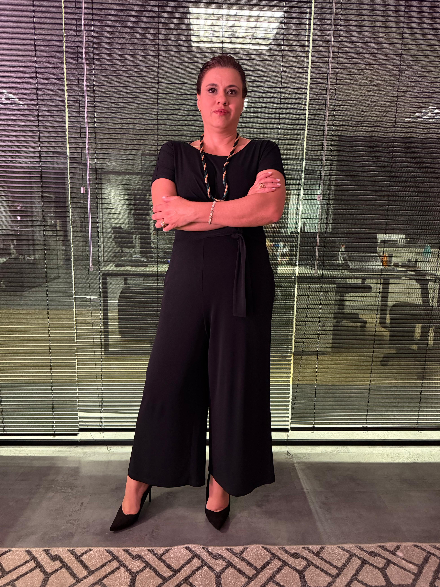
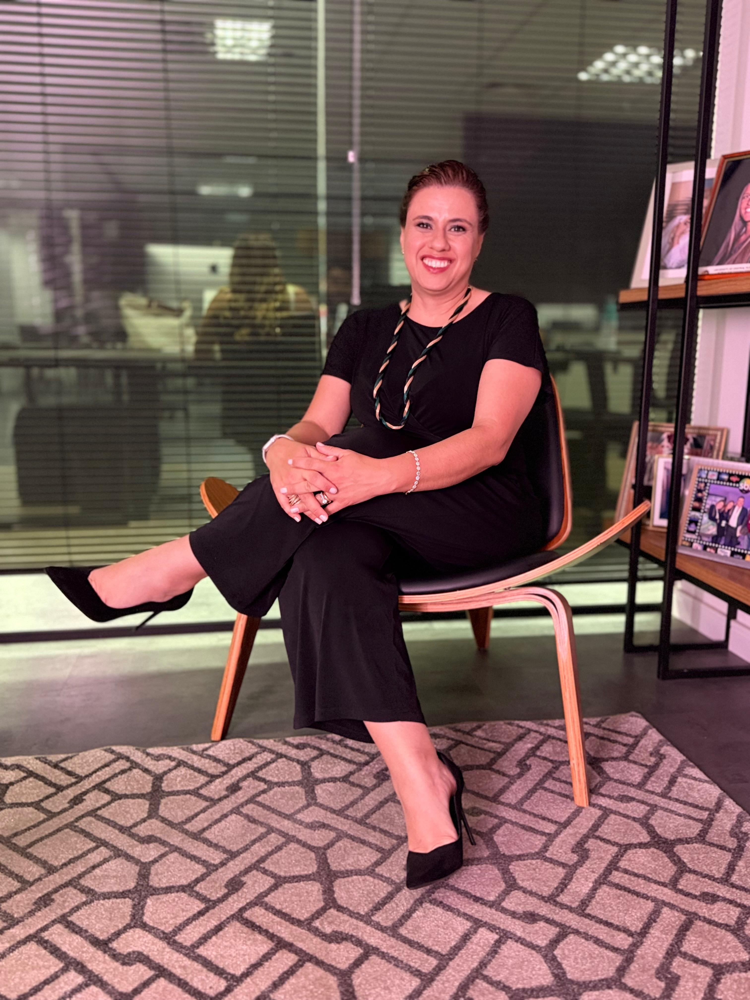

<!DOCTYPE html>
<html lang="pt-BR">
<head>
<meta charset="UTF-8">
<meta name="viewport" content="width=device-width, initial-scale=1.0">
<title>CLP Advocacia Estratégica | Direito Empresarial da Saúde</title>
<meta name="description" content="Escritório full-service com especialização em Direito Empresarial da Saúde. Estruturação jurídica de hospitais, clínicas, laboratórios e sociedades médicas.">
<link rel="preconnect" href="https://fonts.googleapis.com">
<link rel="preconnect" href="https://fonts.gstatic.com" crossorigin>
<link href="https://fonts.googleapis.com/css2?family=Cormorant+Garamond:ital,wght@0,400;0,500;0,600;0,700;1,400;1,500&family=Jost:wght@300;400;500;600&display=swap" rel="stylesheet">
<link rel="stylesheet" href="style.css">
</head>
<body>

<nav id="nav">
  <a href="#top" class="logo-clp" onclick="scrollTo({top:0,behavior:'smooth'})">
    CLP
    
    Advocacia Estratégica
  </a>
  <ul class="nav-links" id="navlinks">
    <li><a href="#sobre" onclick="closeMenu()">Sobre</a></li>
    <li><a href="#saude" onclick="closeMenu()">Saúde</a></li>
    <li><a href="#areas" onclick="closeMenu()">Áreas</a></li>
    <li><a href="#trajetoria" onclick="closeMenu()">Trajetória</a></li>
    <li><a href="#contato" onclick="closeMenu()">Contato</a></li>
  </ul>
  <button class="burger" onclick="toggleMenu()" aria-label="Menu"></button>
</nav>

<header class="hero" id="top">
  
CLP

  

    
Advocacia Empresarial · Atuação em Saúde

    <h1>CLP <em class="gold-text">Advocacia Estratégica.</em></h1>
    
Atuação consultiva e contenciosa em todas as áreas do Direito, com dedicação ao Direito Empresarial voltado à profissionalização e à prevenção jurídica no setor da Saúde — abrangendo a estruturação jurídica de hospitais, clínicas, laboratórios e sociedades médicas. <strong>Cuidar de quem cuida de nós</strong> é o propósito que orienta nossa atuação.

    

      <a href="#contato" class="btn btn-primary">Entre em contato</a>
      <a href="#saude" class="btn btn-ghost">Direito da Saúde</a>
    

  

  
Role para descobrir

</header>

<section class="about" id="sobre">
  

    

      

        
      

      
A Sócia Fundadora

      <h2 class="gold-text">Cristina Loschiavo Pepino</h2>
      

      
Advogada · Sócia Fundadora Direito Empresarial · Societário Compliance · Saúde

      
OAB/SP nº 254.069

      

        

20+

Anos de trajetória

        

7

Setores de atuação

        

2

Idiomas de trabalho

      

    

    

      
Com mais de 20 anos de trajetória na advocacia, Cristina Loschiavo Pepino dedica-se ao Direito Empresarial, com vivência construída ao longo de carreira executiva em departamentos jurídicos de empresas nacionais e multinacionais.

      
Antes de fundar a CLP Advocacia Estratégica, atuou como executiva jurídica em companhias de diferentes setores — alimentação, tecnologia, indústria fonográfica, varejo, hotelaria e saúde —, conduzindo operações de fusões e aquisições, contratos internacionais e questões regulatórias junto a órgãos como ANAC, ANVISA e CVM, com participação em Conselhos de Administração e Assembleias.

      
Esse repertório executivo, somado à formação acadêmica em Direito Empresarial pela FGV Law e em Direito Processual Civil pela Unisul/LFG, fundamenta a atuação da CLP Advocacia Estratégica em todas as áreas do Direito, com atenção particular ao setor da saúde — área que demanda compreensão simultânea das exigências regulatórias, societárias, tributárias e éticas que regem hospitais, clínicas, laboratórios e profissionais médicos.

      
"O conhecimento técnico do Direito ganha sentido quando dialoga com a realidade de quem nos procura."

      

        
      

    

  

</section>

<section class="health" id="saude">
  
+

  

    
Especialização

    <h2 class="gold-text">Direito Empresarial <em>aplicado à Saúde.</em></h2>
    
Atendemos médicos, sociedades médicas, hospitais, clínicas, laboratórios e grupos de saúde com uma compreensão integrada das exigências regulatórias, societárias, tributárias e éticas que governam o setor.

    
"O setor da saúde demanda uma advocacia que compreenda tanto a complexidade da atividade econômica quanto a sensibilidade da relação médico-paciente."

  

  

    

      
i

      <h3>Estruturação de Hospitais, Clínicas e Laboratórios</h3>
      
Acompanhamento jurídico desde a concepção do projeto até a operação plena, com elaboração de contratos sociais, regimentos internos, governança corporativa e regularização junto aos órgãos competentes.

    

    

      
ii

      <h3>Sociedades Médicas e Holdings</h3>
      
Constituição e estruturação de sociedades médicas, holdings patrimoniais e sucessórias para profissionais da saúde, com planejamento societário aderente aos regimes fiscais aplicáveis ao setor.

    

    

      
iii

      <h3>Compliance Regulatório</h3>
      
Adequação às normas da ANVISA, ANS, CFM e demais conselhos profissionais, com elaboração de programas de integridade, políticas internas e gestão de riscos regulatórios específicos da saúde.

    

    

      
iv

      <h3>Contratos com Operadoras e Fornecedores</h3>
      
Negociação e revisão de contratos com operadoras de planos de saúde, fornecedores de insumos médicos, equipamentos e tecnologias, com atenção ao equilíbrio econômico e à segurança jurídica das partes.

    

    

      
v

      <h3>Publicidade Médica e Ética Profissional</h3>
      
Análise de conformidade publicitária à luz da Resolução CFM nº 2.336/2023 e defesa em processos ético-disciplinares perante os Conselhos Regionais e Federal de Medicina.

    

    

      
vi

      <h3>Telemedicina, LGPD e Saúde Digital</h3>
      
Estruturação de operações de telemedicina, adequação à LGPD com proteção qualificada de dados sensíveis em saúde e estratégias jurídicas para startups e plataformas healthtech.

    

  

</section>

<section class="areas" id="areas">
  

    
Áreas de atuação

    <h2 class="gold-text">Atuação consultiva e contenciosa em todas as áreas do Direito.</h2>
    
Para além do Direito da Saúde, a CLP atua em diferentes áreas relevantes ao ambiente empresarial, patrimonial e familiar, atendendo empresas, sócios, profissionais e famílias.

  

  

    

01
<h3>Direito Empresarial</h3>
Consultoria estratégica e contenciosa para empresas de diversos portes e segmentos.

    

02
<h3>Direito Societário</h3>
Constituição, estruturação, M&A e assessoria a sócios nacionais e estrangeiros.

    

03
<h3>Contratos Estratégicos</h3>
Elaboração, negociação e revisão de contratos nacionais e internacionais.

    

04
<h3>Compliance & Governança</h3>
Programas de integridade, gestão de riscos e suporte a processos de auditoria.

    

05
<h3>Direito Imobiliário</h3>
Incorporações, condominial, locações, due diligence e regularização de imóveis.

    

06
<h3>Família e Sucessões</h3>
Planejamento sucessório, holdings familiares, divórcios consensuais e inventários.

    

07
<h3>Trabalhista</h3>
Atuação consultiva e contenciosa em relações de trabalho e demandas individuais.

    

08
<h3>Direito do Consumidor</h3>
Defesa de direitos individuais e suporte a empresas em relações de consumo.

  

</section>

<section class="diff">
  

    

      
Princípios

      <h2 class="gold-text">Princípios que orientam nossa atuação.</h2>
      
A atuação da CLP Advocacia Estratégica é construída sobre quatro princípios que estruturam o trabalho do escritório e a relação com seus clientes.

    

    

      

01

<h4>Compreensão do negócio</h4>
Trajetória executiva em departamentos jurídicos de empresas, com leitura das realidades operacionais e setoriais que envolvem cada demanda.

      

02

<h4>Fundamentação técnica</h4>
Atuação pautada em legislação vigente, doutrina e jurisprudência consolidada, com pareceres e peças sempre fundamentados em fontes oficiais.

      

03

<h4>Atendimento dedicado</h4>
Comunicação direta com o cliente e acompanhamento integral das matérias, com clareza nas explicações técnicas e nas etapas processuais.

      

04

<h4>Sigilo profissional</h4>
Tratamento confidencial das informações compartilhadas pelo cliente, em observância às exigências éticas e legais que regem a advocacia.

    

  

</section>

<section class="journey" id="trajetoria">
  

    
Trajetória profissional

    <h2 class="gold-text">Mais de duas décadas em advocacia corporativa.</h2>
  

  

    
Trajetória construída ao longo de mais de vinte anos na advocacia, com atuação consolidada em departamentos jurídicos de empresas nacionais e multinacionais. A vivência executiva abrangeu setores diversos da economia, com responsabilidade direta sobre operações de fusões e aquisições, contratos internacionais, governança corporativa, compliance e questões regulatórias junto a órgãos como ANAC, ANVISA e CVM, incluindo participação em Conselhos de Administração e Assembleias de companhias abertas.

    
Esse percurso permitiu o desenvolvimento de uma atuação que combina rigor técnico, leitura estratégica das demandas corporativas e compreensão das exigências regulatórias específicas de cada setor — repertório que hoje fundamenta o trabalho consultivo e contencioso oferecido pelo escritório.

    
Em 2019, foi fundada a CLP Advocacia Estratégica, dedicada à atuação em todas as áreas do Direito, com atenção particular ao Direito Empresarial da Saúde — abrangendo a estruturação jurídica de hospitais, clínicas, laboratórios e sociedades médicas, bem como o assessoramento de profissionais da área.

    

      Setores de atuação
      Saúde
      Tecnologia
      Financeiro
      Alimentação
      Indústria Fonográfica
      Varejo
      Hotelaria
      Construção Civil
      Imobiliário
    

  

</section>

<section class="education" id="formacao">
  

    
Formação acadêmica

    <h2 class="gold-text">Formação acadêmica e especialização.</h2>
  

  

    

2016
<h3>Direito Empresarial</h3>
Pós-graduação · FGV Law

    

2008
<h3>Direito Processual Civil</h3>
Pós-graduação · Unisul / Rede LFG

    

2005
<h3>Direito</h3>
Graduação · Faculdade de Direito de São Bernardo do Campo

  

  

    Idiomas
    Português <em>Nativo</em>
    Inglês <em>Fluente</em>
  

</section>

<section class="contact" id="contato">
  

    
Atendimento

    <h2 class="gold-text">Entre em <em>contato.</em></h2>
    
Para conhecer melhor a atuação do escritório ou solicitar uma consulta, utilize um dos canais abaixo.

    <a href="https://wa.me/5511997103699" class="btn btn-primary">Falar pelo WhatsApp</a>
    

      

Telefone
<a href="tel:+5511997103699">+55 11 99710-3699</a>

      

WhatsApp
<a href="https://wa.me/5511994693426">+55 11 99469-3426</a>

      

Localização
São Paulo · SP · Brasil

    

  

</section>

<footer>
  <a href="#top" class="logo-clp">
    CLP
    
    Advocacia Estratégica
  </a>
  
© 2026 CLP Advocacia Estratégica · Cristina Loschiavo Pepino · OAB/SP nº 254.069

</footer>

</body>
</html>
